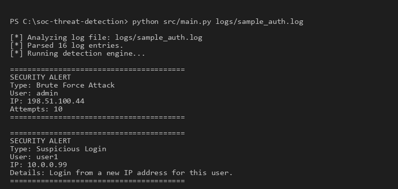
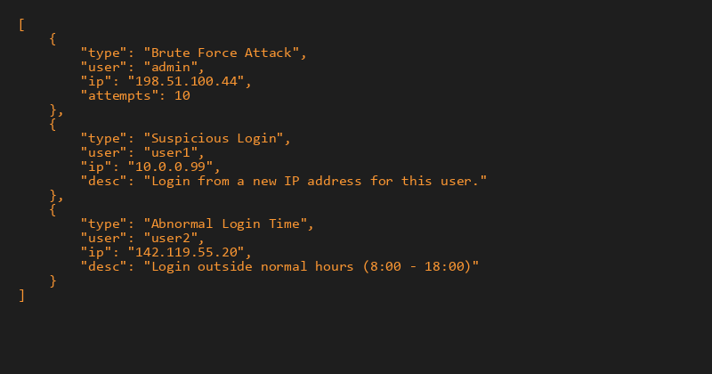

# 🛡️ SOC Threat Detection Log Analyzer

A simple but realistic Security Operations Center (SOC) log analysis tool that reads authentication logs and detects suspicious behavior such as brute force attacks. Built as an educational project suitable for a cybersecurity portfolio.

## 🎯 Project Overview

This tool mimics the functionality of a Security Information and Event Management (SIEM) system by parsing raw log data, applying security rules to identify potential threats, and generating actionable incident alerts.

### 🏢 Architecture Overview

The system is broken down into four main components:

```text
     Linux Logs
         │
         ▼
 Log Parser (Regex)
         │
         ▼
  Detection Engine
         │
         ▼
   Alert Manager
         │
         ▼
incident_report.json
```

1. **Log Parser** (`src/log_parser.py`): Reads standard Linux authentication logs, extracting the timestamp, user, IP address, and login outcome.
2. **Detection Engine** (`src/detection_engine.py`): Analyzes parsed logs against a set of predefined security rules:
   - **Brute Force Attack**: More than 10 failed login attempts from the same IP within 5 minutes.
   - **Suspicious Login**: Successful login from a previously unseen IP address for a known user.
   - **Abnormal Login Time**: Successful login outside normal business hours (18:00 - 08:00).
3. **Alert Manager** (`src/alert_manager.py`): Displays human-readable alerts and saves detailed logs to `incident_report.json`.

## 🧠 Why This Matters in SOC Operations

Brute force attacks are commonly used to gain unauthorized access to servers. Detecting repeated failed login attempts helps security teams respond before attackers compromise accounts. Suspicious logins from new IP addresses or anomalous timeframes act as strong indicators of compromise (IoC) or insider threats. Context matters in cybersecurity, and this tool helps automate the detection phase so analysts can focus on rapid incident response!

## 📸 Screenshots

**Terminal Alert Output:**  


**Generated JSON Incident Report:**  


## 🔍 Example Incident Investigation

**Alert Type:** Brute Force Attack  
**Source IP:** `192.168.1.100`  
**Target User:** `admin`  

**SOC Analyst Investigation Steps:**
1. Detection engine flagged 10 repeated failed logins mapped across a 5-minute sliding window.
2. Analyst reviewed the SIEM alerts dynamically generated in the console terminal.
3. The Source IP (`192.168.1.100`) was verified as anomalous and positively identified as an external attacker.
4. Incident report was generated (`incident_report.json`) sequentially for documentation, paving the way for immediate IP blocklisting at the organization's border firewall.

## 🚀 Installation Steps

1. Clone or navigate to the project directory.
2. Install the required dependencies:

```bash
pip install -r requirements.txt
```

## ⚙️ Usage Example

Run the main application providing a log file as an argument:

```bash
python src/main.py logs/sample_auth.log
```

### Example Terminal Output

```text
[*] Analyzing log file: logs/sample_auth.log
[*] Parsed 16 log entries.
[*] Running detection engine...

========================================
SECURITY ALERT
Type: Brute Force Attack
User: admin
IP: 192.168.1.100
Attempts: 10
========================================

========================================
SECURITY ALERT
Type: Suspicious Login
User: user1
IP: 10.0.0.99
Details: Login from a new IP address for this user.
========================================

[+] Saved 3 alerts to incident_report.json
```

## 🧪 Running Tests

This project uses `pytest` for unit testing the detection engine. Run the tests via:

```bash
pytest tests/
```

## 🐳 Docker Support

Run the tool inside a fully-isolated Docker container:

```bash
docker build -t soc-analyzer .
docker run soc-analyzer
```
